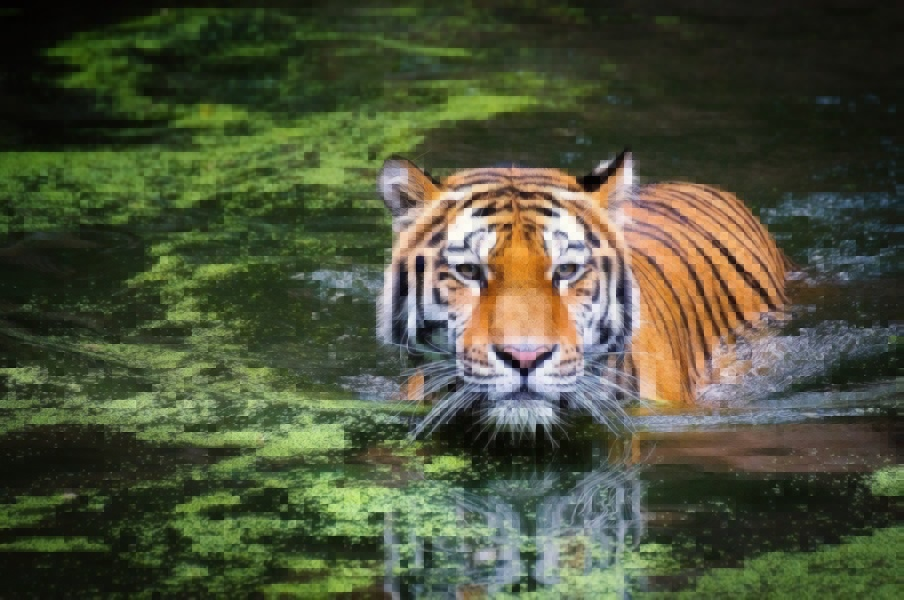

# JPEG Compression from scratch

JPEG compression implemented in C++, using opencv4.

## Usage
[To install `myjpeg`, see [Install](#install) section]

```bash
myjpeg {image_file_path} [--qmi=N]
```
Here, `--qmi=N` gives the quantisation level. Valid values are {0,1,2,3} where 0 is no quanisation, and 1-3 are decreasing levels of quantisation (i.e. 3 should be clearer than 1).

## Example
`images/` includes test images. Note these are themselves JPEGs, and are thus already compressed. Here, we apply a more aggressive quantisation, so the compression is visually obvious:
```bash
myjpeg images/test_4.jpg --qmi=3
```
This will render before and after images, like so:
<br><br>
**Before:**
<br><br>

<br><br>
**After:**
<br><br>

<br><br>
Now, we use a more aggressive quantisation, e.g. `--qmi=1`:
```bash
myjpeg images/test_4.jpg --qmi=1
```
This yields a much more noticeable compression:
<br><br>
**Before:**
<br><br>

<br><br>
**After:**
<br><br>

<br><br>

## Install
[Note - install steps only given for MacOS and Linux]
<br><br>
First, install opencv.
<br><br>
On mac, run:
```bash
brew install opencv
```

On linux, run:
```bash
sudo apt install libopencv-dev
```
Now, simply run our `install.sh` script:
```bash
chmod +x scripts/install.sh
./scripts/install.sh
```
At this point, `build/` should have a `myjpeg` binary. To install globally (i.e. in /usr/local/bin), run:
```bash
cd build/
sudo make install 
```